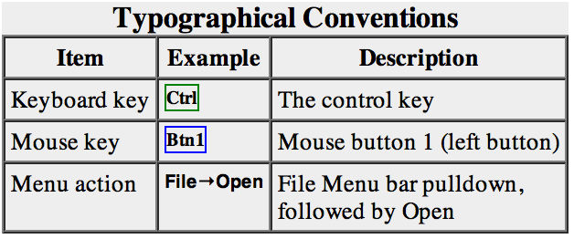
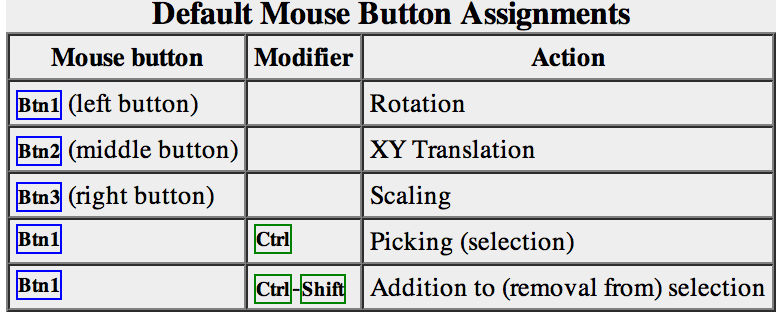
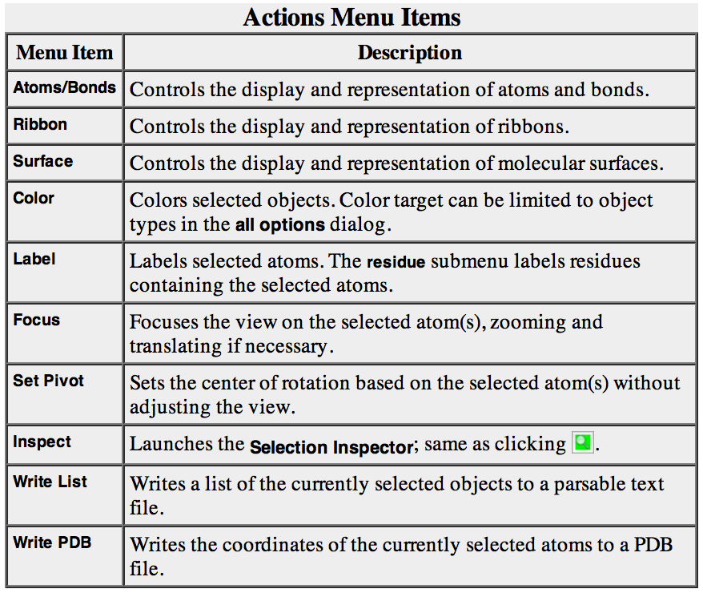
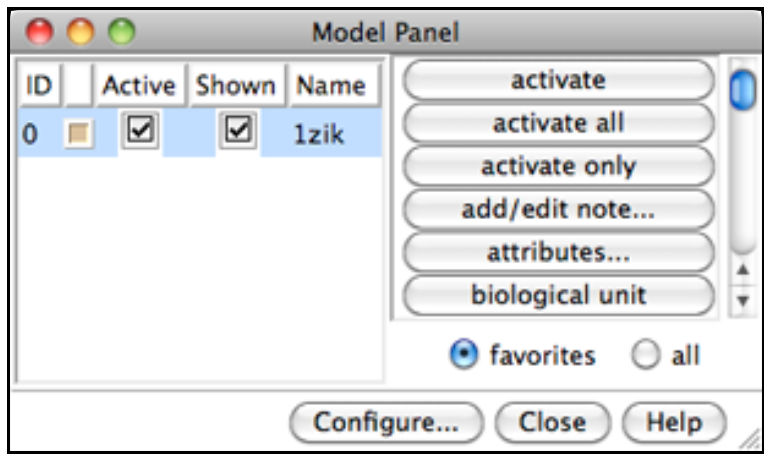
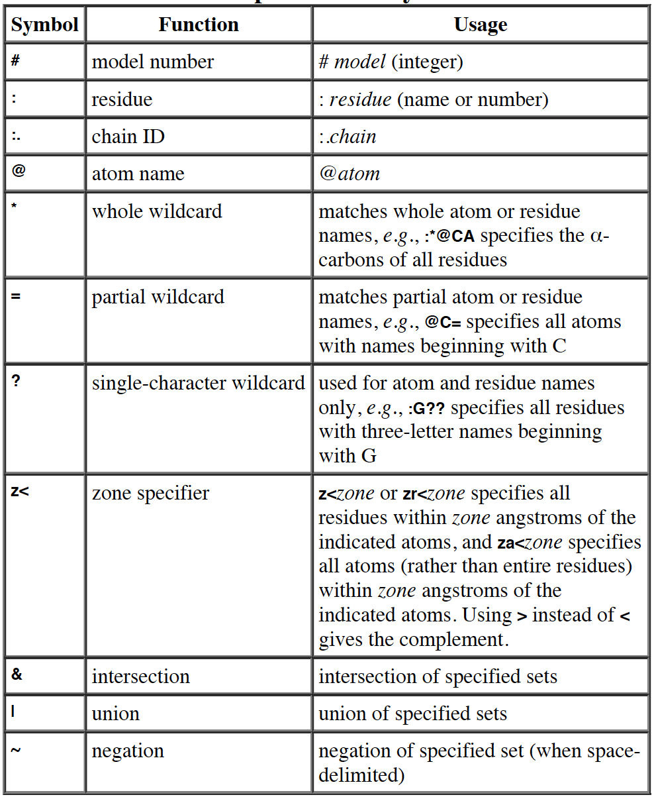

------------

> ## Learning Objectives
>
> * Learners can describe Chimera's basic features
> * Learners can upload a structure (e.g. a ClusPro model)
> * Learners can select one or more residues
> * Learners can calculate atomic distances

------------

This tutorial is adapted from the [UCSF Chimera - Getting Started Tutorial](https://www.cgl.ucsf.edu/Outreach/Tutorials/GettingStarted.html)

#Getting started
You can interact with Chimera using menus and/or commands. The basic features of Chimera are available either way, but not all command functions are available in menus or graphical interfaces, and not all menu or graphical interface functions are available in commands. Thus, it is useful to become familiar with both ways of interacting with Chimera.

Start Chimera by clicking or doubleclicking the Chimera icon (depending on its location). Typically, this icon will be present on the desktop. The Chimera executable can also be run from its installation location.

A splash screen will appear, to be replaced in a few seconds by the main Chimera window containing either the graphics display or the Rapid Access list of recently used files (it doesn't matter which, since opening a structure will automatically switch the display to the graphics window). If you like, enlarge the window by clicking and dragging its lower right corner. The window can also be moved by clicking its top bar and dragging.



##Opening a structure

Now open a structure. Choose 

```
File → Open 
```

from the menu and enter the first model you downloaded from ClusPro (e.g. model.000.00.pdb). The structure will appear in the graphics window; 

The default initial display is ribbons. To also display atoms:

```
    Actions→Atoms/Bonds→show
```
This shows all of the atoms and bonds in the structure, except that those in the peptide backbone are suppressed by the ribbon display. How to indicate specific parts of a structure for display, coloring, etc. is discussed below. Initially, heteroatoms (atoms other than carbon) are color-coded by element: oxygens red, nitrogens blue, etc. The carbons retain the model color, in this case tan.

Hide ribbons to reveal the backbone atoms, then show ribbons again:

```
    Actions→Ribbon→hide
    Actions→Ribbon→show
```

Try manipulating the structure in the main window with the mouse. By default:

* the left mouse button controls rotation
* the middle mouse button controls XY translation (panning)
* the right mouse button performs scaling (zooming)




If you are using a touchpad or single-button mouse, modifier keys allow emulating the middle and right mouse buttons. These are *option* and *command* on Mac keyboards. Multitouch gestures on a Mac touchpad are enabled by default, but can be turned off in the preferences (menu: *Favorites→Preferences*, category *Mouse*). Continue moving and scaling the structure with the mouse in the graphics window as desired throughout the tutorial.
When the mouse focus is in the graphics window (you may need to click into it if you have been interacting with a different window), hovering the mouse cursor over an atom or bond without clicking any buttons will show identifying information in a pop-up “balloon.” The balloon will disappear when the cursor is moved away. For an atom, the balloon information is of the form:

    *res-name  res-num.chain  atom-name*

You can see from the balloons that this structure contains two peptide chains, A and "No ID", and no water (HOH residues).

##Selection with the mouse

In combination with modifier keys, the mouse buttons have additional functions. By default, picking from the screen (a type of selection) is done by Ctrl-clicking an atom or bond with the left mouse button, Btn1. You can also drag out a selection area with Ctrl-Btn1 (sweep out an area before releasing). Shift-Ctrl-Btn1 adds to or toggles an existing selection. The selection is outlined in green, and placing the mouse cursor over the green magnifying glass icon near the bottom right corner of the window reports what is selected in a pop-up “balloon.”

The arrow keys can be used to broaden (↑), narrow (↓), or invert (→) a selection. The hierarchy for broadening and narrowing a selection could include (depending on the initial selection): atom/bond, residue, protein secondary structure element, bonded set of atoms, all atoms with the same chain ID, entire model. When a selection is inverted, the selected atoms become deselected and vice versa.

Spend some time selecting various parts of the structure. An easy way to clear the selection (deselect everything) is to use Ctrl-Btn1 in any blank space in the graphics window.

## Selection/Action

In general, operations performed with the Chimera Actions menu apply to the current selection. Selections can be made in many ways, including with the Select menu or with the mouse (as described above). When nothing is selected, the Actions menu applies to everything.




The following will color all residues named LYS hot pink.

```
    Select→Residue→LYS
    Actions→Color→hot pink
```

The selection is highlighted in green, and the magnifying glassicon  near the bottom right corner of the window is also green, indicating that something is selected. Clearing the selection (deselecting) beforehand will color everything:

```
    Select→Clear Selection
    Actions→Color→hot pink
```

Select menu choices also include chain ID, element, and many other categories of atoms and residues. (More complicated selections can be built up by intersecting some of these choices)

```
    Select→Chain→B
    Actions→Color→cyan
    Actions→Ribbon→hide
    Select→Structure→solvent
    Actions→Atoms/Bonds→hide
    Select→Chemistry→element→N
    Actions→Atoms/Bonds→sphere
    Select→Clear Selection
    Actions→Atoms/Bonds→stick
```
Now, we want to select MKK7 Lys149 (2DYL: K165), R162 (2DYL: R178) and Lys157 (2DYL: K173), and Gadd45β Glu65 (gadd45B_model.pdb: E65), Glu66 (gadd45B_model.pdb: E66), and Glu113 (gadd45B_model.pdb: E113).

First, notice that in the ClusPro model, MKK7 corresponds to Chain A, whereas Gadd45β corresponds to "no ID" or "principal chain". 

One way to select specific residues or ranges of residues is in the Sequence tool: menu *Favorites→Sequence*, *show sequence for model.000.00.pdb (#0) chain A* (for MKK7) or *model.000.00.pdb (#0) principal chain* (for Gadd45β). 
When the sequence window has mouse focus, placing the cursor over a residue symbol in the sequence shows information for the corresponding structure residue at the bottom of the window. Click-drag a box within the sequence window to select one or more residues (as opposed to simply clicking within the light yellow box, which will select the entire helix).

If you want to select residues or group of residues that are not adiacent in the sequence, you can use Shift-drag to add them to the initial selection. Thus, if you want to select MKK7 K165, R178, and K173, you have to select one of them, then you can add the other two by using Shift-drag.

Once you obtained the selection you wanted, you can do several things. For example, you may want to display side chains and change the colour of the selected residues.

```
    Action→color→red
    Actiont→Atom/Bondst→side chain/base
```

Quit from the sequence window and display all protein atoms again:

```
    Select→Structure→protein
    Actions→Atoms/Bonds→show
```

Coloring can be limited to only certain representations, such as atoms only (not ribbons, surfaces, etc.):

```
    Select→Residue→GLU
    Actions→Color→all options
```

In the resulting Color Actions dialog:

* choose to Show all colors (lower right)
* change the Coloring applies to (target) setting to atoms/bonds
* click to choose any color
Notice that only the atoms/bonds of the selected residues and not their ribbon segments change color. Clear the selection (main menu Select→Clear Selection), then in the Color Actions dialog:
* change the coloring target back to all of the above
* click to choose tan (colors are listed alphabetically in the all-colors section)
* click Close to dismiss the dialog
* Restore heteroatom color-coding:

```
    Actions→Color→by heteroatom
```

Coloring by heteroatom is useful for showing functional groups, yet keeping different models distinguishable by their different carbon colors.

Try picking two atoms in different residues (*Ctrl-click the first, Shift-Ctrl-click the second*). Show residue labels for the atoms you have selected:

```
    Actions→Label→residue→name + specifier
```
(Actions→Label→name would show the atom names instead.) These 3D labels move along with structures and are mainly for interactive use. For figures and movies, 2D Labels are recommended instead.

Promote the selection to the entire residues with the keyboard up arrow ↑ or the following:

```
    Select→Broaden
```

Show only the selected atoms:

```
    Actions→Atoms/Bonds→show only
```

Clear the selection by Ctrl-clicking in empty space, as if picking “nothing.”

Turn off residue labels, hide ribbon, display all atoms, and color by element:

```
    Actions→Label→residue→off
    Actions→Ribbon→hide
    Actions→Atoms/Bonds→show
    Actions→Color→by element
```

The by element coloring is the same as by heteroatom except it also color-codes carbons (gray).

## Models and model status

Generally, each file of coordinates opened in Chimera becomes a model with an associated model ID number. Models are assigned successive numbers starting with 0. The Model Panel lists the current models and enables many operations upon them. Open this tool with *Tools→General Controls→Model Panel*.

The columns on the left side of the Model Panel show:

model ID number
model color
A(ctive) - whether activated for motion
S(hown) - whether display-enabled
model name



Try toggling the checkboxes to see what happens; a model that is not activated for motion cannot be rotated or translated interactively. In the list of functions on the right side of the Model Panel (not the button at the bottom), click close to remove model 1zik. Use the Close button at the bottom to close the Model Panel.

You can exit from Chimera with File→Quit.

# Working with Commands

## Manipulation, Selection, and Chains

You can interact with Chimera also using commands. You may prefer using commands, menus or both. In order to use commands, you have to show the Command Line with Tools→General Controls→Command Line. By default, the Command Line. By default, the Command Line is also listed in the Favorites menu.

## Opening a structure
Now open a structure. To fetch a structure from the Protein Data Bank (PDB), use the command:
```
Command: open 2DYL
```
The structure will appear in the graphics window;
The default initial display is ribbons. To also display atoms:
```
Command: display
```
This shows all of the atoms and bonds in the structure, except that those in the peptide backbone are suppressed by the ribbon display. How to indicate specific parts of a structure for display, coloring, etc. is discussed below. Initially, heteroatoms (atoms other than carbon) are color-coded by element: oxygens red, nitrogens blue, etc. The carbons retain the model color, in this case tan. 

Hide ribbons to reveal the backbone atoms, then show ribbons again:

```
Command: ~ribbon
Command: ribbon
```

*Many commands have “~” versions that perform the opposite function.*

## Command/Target
A Chimera command may include arguments and a target (or atom specification). For example, in the following color command,

```
Command: color hot pink :lys
```

hot pink is an argument that specifies a color name, and :lys specifies that the target is all residues named LYS.
If no target is specified, the command acts on all applicable items. For example, the following makes everything hot pink:

```
Command: color hot pink
```

A basic specification may contain *residue names, residue numbers, chain* identifiers, and/or atom names (see the table of symbols below).



Note also that commands can be truncated to unique strings.

```
Command: color red :60-68
Command: col gray :150-165.a
Command: col cyan :.a
Command: disp :60-70
Command: ~ribbon :.a
Command: ribbon :.a
Command: ~disp :165-170.a,60-70.
Command: disp :165-170.a,60-90
Command: disp :165.a,178.a,173.a,65,66,67,113
Command: select :165.a,178.a,173.a,65,66,67,113
Command: represent sphere
```

Notice that the command *represent sphere* will switches the *display* to sphere. If you want *display* to display sticks, you have to do:

```
Command: rep stick
```

Try the following sequence of commands and see what happens at each step:

```
Command: rep sphere
Command: ~display
Command: display
Command: ~display
Command: rep stick
Command: display
Command: ~display
```

The Chimera Quick Reference Guide lists all of the commands and gives some examples of atom specification. It can be accessed by choosing Help→Tutorials from the Chimera menu and clicking the “Chimera Quick Reference Guide” link.

Many other types of specifications can be used, including element symbols and built-in classifications such as solvent (notice that docking models don't have solvent, therefore in this case the command will have no effect):

```
Command: ~disp solvent
Command: color blue S
Command: disp protein
```

The command help can be used to show the manual page for any command:

```
Command: help color
```
As explained in the manual page, the color command also allows coloring only certain representations.

For example, “,a” in the following means atoms only (not ribbons, surfaces, etc.):

```
Command: col gold,a :glu,lys

```

Restore the original coloring:

```
Command: col tan
Command: col byhet
```

Coloring by heteroatom is useful for showing functional groups, yet keeping different models distinguishable by their different carbon colors. 

Try picking two atoms in different residues (Ctrl-click the first, Shift-Ctrl-click the second). Unlike the Actions menu, commands do not automatically act on the current selection. However, the current selection can be specified as the target of a command with the word *selected*, *sel*, or *picked*. 

Show residue labels for the atoms you have selected:

```
Command: rlabel sel
Command: ~rlabel sel
```

(The label command shows atom information instead.) The 3D labels from rlabel and label move along with structures and are mainly for interactive use. For figures and movies, 2D Labels are recommended instead.

```
Command: disp sel
```

The following command can be used to promote the selection to the entire residues:

Command: select up
(The keyboard up arrow ↑↑ also broadens a selection, but you may need to click into the graphics window
first to use that approach.) Show only the selected atoms:
Command: show sel
Clear the selection by Ctrl-clicking in empty space, as if picking “nothing.”
Turn off residue labels, hide ribbon, display all atoms, and color by element:
Command: ~rlab
Command: ~ribbon
Command: disp
Command: col byelement
Coloring byelement is the same as byhet except it also color-codes carbons (gray).

# Models and model status
Generally, each file of coordinates opened in Chimera becomes a model with an associated model ID number. Models are assigned successive numbers starting with 0.
The Active models line right under the Command Line shows which models are activated for motion. Unchecking the box for 0 makes it impossible to rotate or translate model 0 interactively. Checking the box again restores the movable state. A similar row of checkboxes for toggling model display can be shown using the preferences (menu: Favorites→Preferences, category Command Line).

Remove the model:

```
Command: close 0
```

You can exit from Chimera with the following command:

```
Command: stop
```

