## Tutorial on Homology Modelling

------------

> ## Learning Objectives
>
> * Introduce Homology modelling principles
> * Learn about online tools to build a model by homology
> * Critically select templates
> * Build the homology model of Gadd45β using HHPred 
> * Do model quality assessment using QMEAN
> * Point to relevant information on how to get help, and understand how to ask well formulated questions

------------

> ## Learning Outcomes
> By the end of this lesson, the learner will be able to:
> * List and discuss the Homology modelling principles
> * Describe the tools for homology modelling available at https://toolkit.tuebingen.mpg.de/#/
> * Justify the choice of a given template over the others
> * Build the homology model of Gadd45β using HHPred 
> * Do model quality assessment using QMEAN
> * Point to relevant information on how to get help.

------------

In this tutorial we will see how to build the homology model of Gadd45β. 

Let's start with some introduction on the three-dimensional (3D) structure of proteins. 
Where can we find the spatial coordinates of biological macromolecules? 

The Protein Data Bank ([PDB](http://www.rcsb.org)) is the major resource for macromolecular structures. This resource archives information about the 3D shapes of proteins, nucleic acids, and complex assemblies.

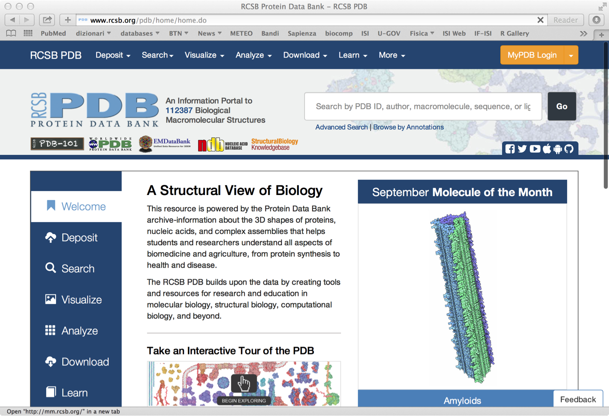

A text file contains both meta information (annotation) lines and coordinate lines (starting by "ATOM").

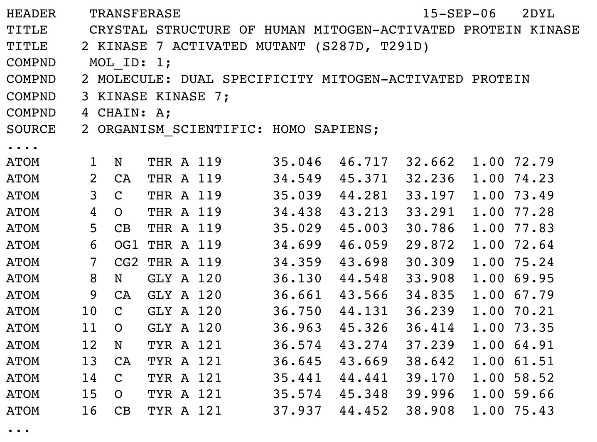

In most of the cases, the structure of proteins has not yet been determined and X-ray and NMR experiments are *expensive* and time demanding. 

* 549,832 (SwissProt) + 54.540.801 (TrEMBL) Nov 2015
* 114.080 (PDB), 28244 unique(<30% SeqId), Nov 2015
* The difference between the number of sequences and structures is growing

What can we do when the coordinates of a protein are not available in the PDB? 

*Computational approaches:*

* Fast (minutes/hours), cheap (PC)
* Correct solutions in ~60% of cases
* Low risolution but often sufficient to many purposes

Is it possible to predict a protein structure from its sequence? 

## Homology modelling

Homology modelling is a procedure to predict the 3D structure of a protein. It relies on a few principles:

* The structure of a protein is uniquely determined by its amino acid
* Therefore the sequence should, in theory, contain enough information to obtain the structure 
* Similar sequences have been found to adopt practically identical structures while distantly related sequences can still fold into similar structures

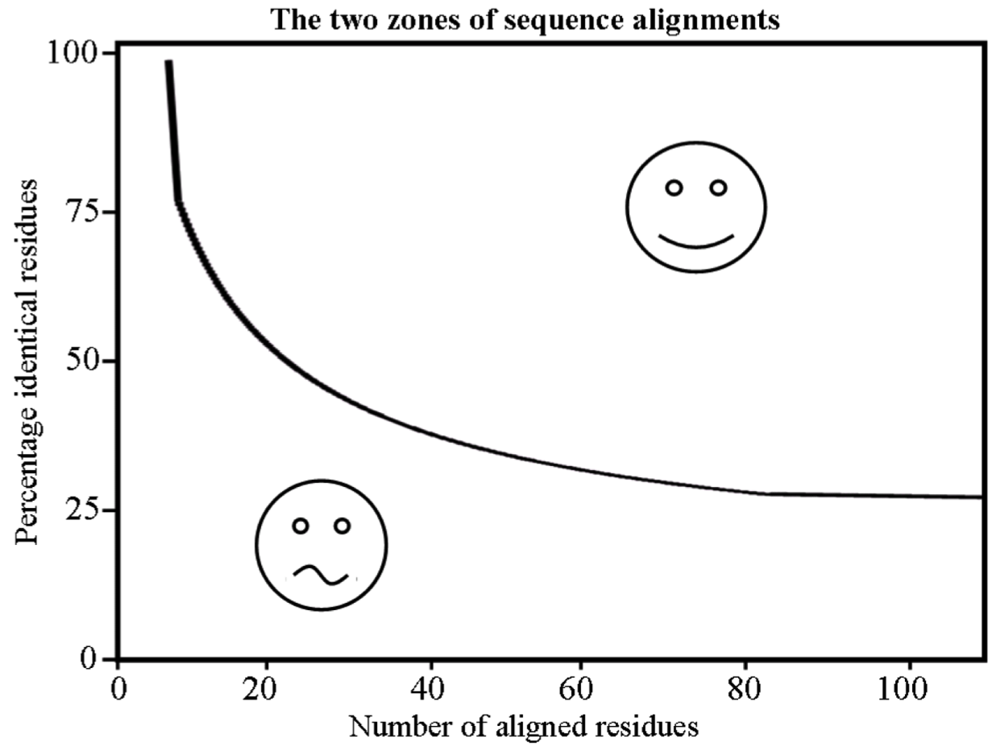
Chothia et al. 1986; Sander et al. 1991; Rost 1999

The predictive methods to adopt strongly depend on the percentage of sequence identity between the protein of unknown structure ("target") and a protein with known structure ("template").

|Approach|identity percentage/homology|
|---------------------|---------------|
|Comparative modeling | > 30% sequence identity|
|Threading/Fold recognition|0 – 30% sequence identity|
|Ab initio/de novo|no homologous|

The percentage of sequence identity also affects the quality of the final model and, therefore, of the studies you can carry out with the model.

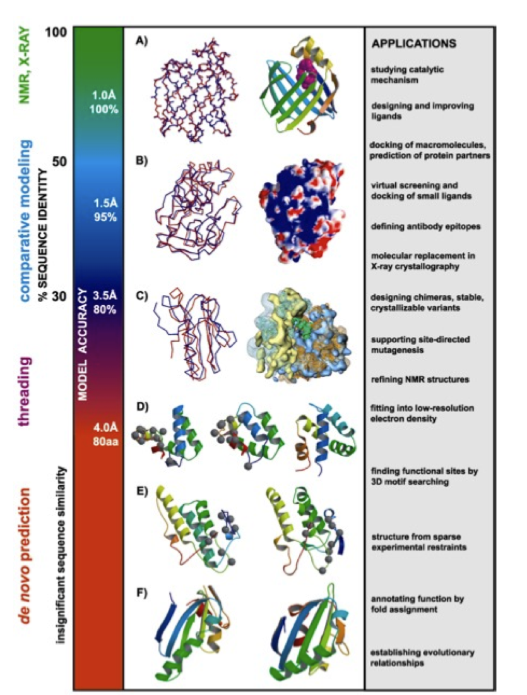

sequence identity|model quality
:-----------------:|--------------
60-100%          |Comparable with average resolution NMR. Substrate specificity
30-60%           |Starting point for site-directed mutagenesis studies
< 30%            | Serious errors

#### Homology modelling basically consists of 8 steps

1. Template recognition and initial alignment 
2. Alignment correction 
3. Backbone generation 
4. Loop modeling 
5. Side chain modelling 
6. Model optimisation 
7. Model validation (by hand or using different servers)
8. Iteration to correct mistakes (if any)

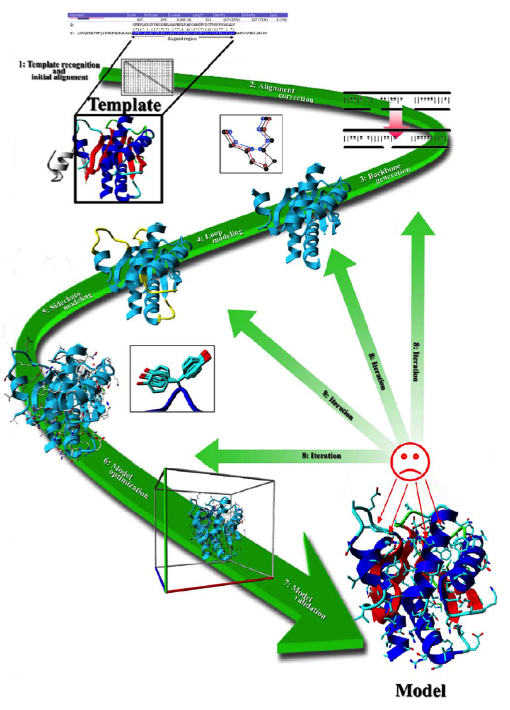

### Step 1: Template recognition and initial alignment 
* To identify the template, the program compares the query sequence to all the sequences of known structures in the PDB (e.g. BLAST)
* Usually, the template structure with the highest sequence identity and coverage will be the first option
* Other considerations:
* conformational state (i.e. active or inactive) 
* present co-factors
* other molecules or multimeric complexes
* It is possible to choose multiple templates and build multiple models 
* It is possible to combine multiple templates into one structure that is used for modeling 

### Step 2: Alignment correction
Having identified one or more possible modeling templates using the initial screen described above, more sophisticated methods are needed to arrive at a better alignment 

### Step 3: Backbone generation 
* When the alignment is ready, the actual model building can start 
* Creating the backbone is trivial for most of the model: one simply transfers the coordinates of those template residues that show up in the alignment with the model
* If two aligned residues differ, the backbone coordinates for N, Cα, C and O and often also the Cβ can be copied
* Conserved residues can be copied completely to provide an initial guess 

# ##Step 4: Loop modeling  
* For the majority of homology model building cases, the alignment between model and template sequence contains gaps 
* Gaps in the model-sequence are addressed by omitting residues from the template 
* Gaps in the template sequences are treated by inserting missing residues the into the continuous backbone 
* Changes in loop conformation are notoriously hard to predict 

Loop modelling: a search is made through the PDB for known loops containing endpoints that match the residues between which the loop is to be inserted. 

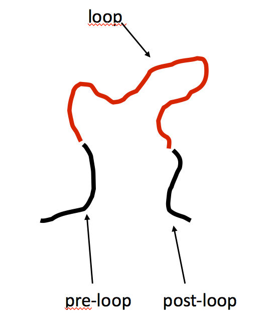

### Step 5: Side chain modeling 
* Libraries of common rotamers extracted from high resolution X-ray structures are often used to position side chains 
* The various rotamers are subsequently explored and scored with a variety of energy functions 

### Step 6: Model optimisation  
* To predict the side chain rotamers with high accuracy, we need the correct backbone, which in turn depends on the rotamers and their packing
* The common approach to address this problem is to iteratively model the rotamers and backbone structure
* First, we predict the rotamers, then remodel the backbone to accommodate rotamers, followed by a round of refitting the rotamers to the new backbone
* This process is repeated until the solution converges 
* This boils down to a series of rotamer prediction and energy minimisation steps 

### Step 7: Model validation 
* Every protein structure contains errors, and homology models are no exception 
* The number of errors (for a given method) mainly depends on two values: 
	- The percentage sequence identity between template and model-sequence 
	- The number of errors in the template 
* There are two principally different ways to estimate errors in a structure 
	- Calculating the model's energy based on a force field 
	- Determining normality indices that describe how well a given characteristic of the model resembles the same characteristic in real structures 

### Step 8: Iteration to correct mistakes
* When errors in the model are recognised and located, they can be corrected by iterating portions of the homology modeling process. 
* Small errors that are introduced during the optimisation step can be removed by running a shorter molecular dynamics simulation 
* A error in a loop can be corrected by choosing another loop conformation in the loop modeling step
* Large mistakes in the backbone conformation sometimes require the complete process to be repeated with another alignment or even with a different template 

Valuable resources for homology modelling are MODELLER and SWISS-MODEL.

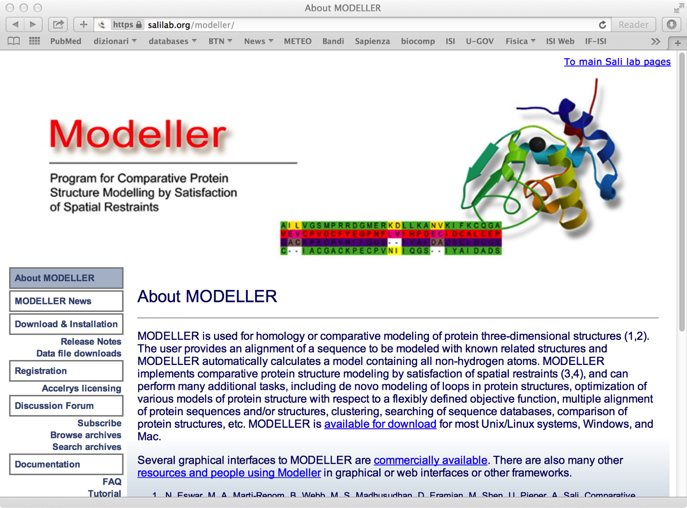

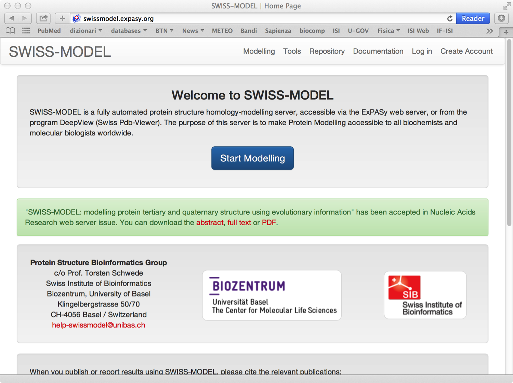

### Homology model of Gadd45β

1) First, we have to identify the protein sequence of Gadd45β. 
Go to UniProt (http://www.uniprot.org), type the Gadd45β UniProt AC (O75293) in the text box at the top and click on Search. On the result page, go to the sequence information (you can scroll-down until you reach the Sequence section or directly click on the "Sequence" link on the left). Click on the FASTA link and copy the sequence in FASTA format. 

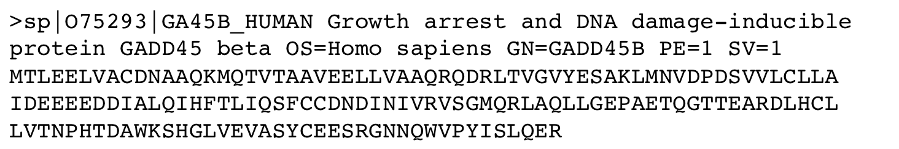

2) Second, we have to identify a suitable template for Gadd45β. 
Go to HHPred and paste the Gadd45β in FASTA format into the Input text box. Inspect all the Search Options (but keep the default ones).
In the "Job Options" section, specify a Job-ID (e.g. gadd45B). Then Submit your job. The run may last up to a few minutes. However, Gadd45β is a small protein (160 aa) and the template search should be quite fast.

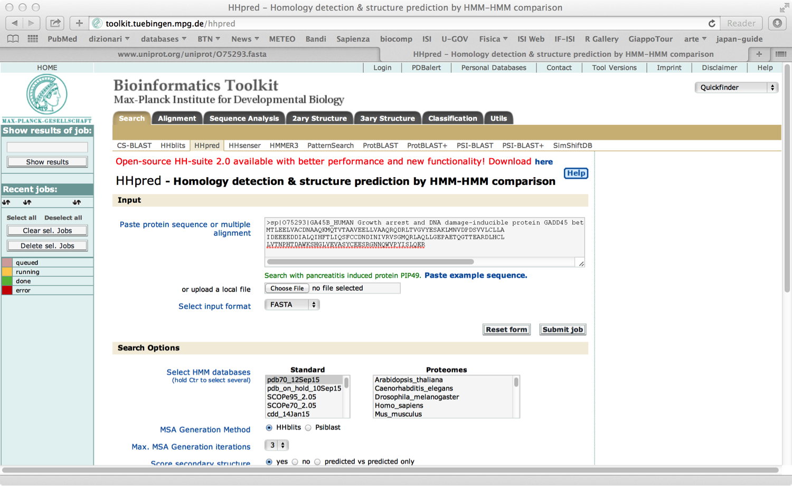

3) In the HHpred result page, inspect the proposed templates. 

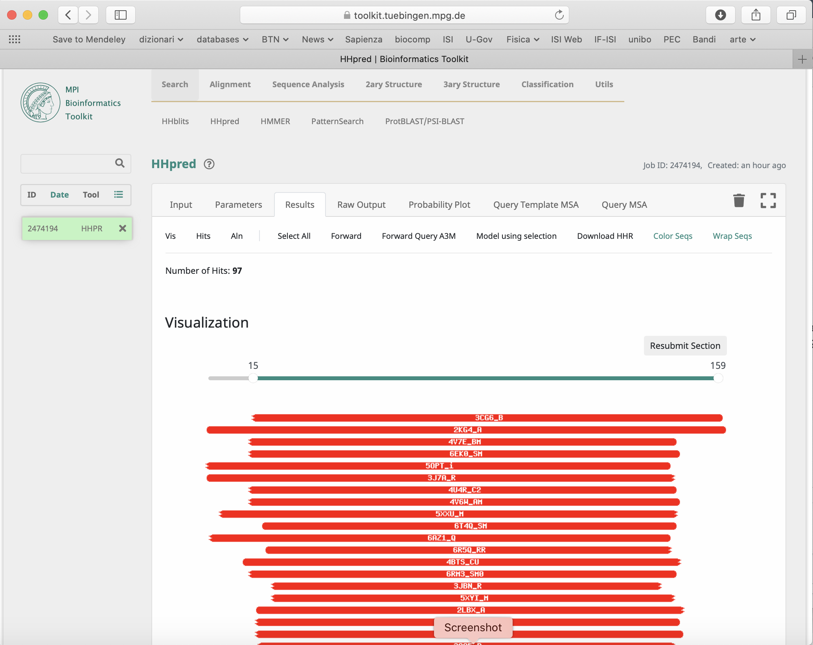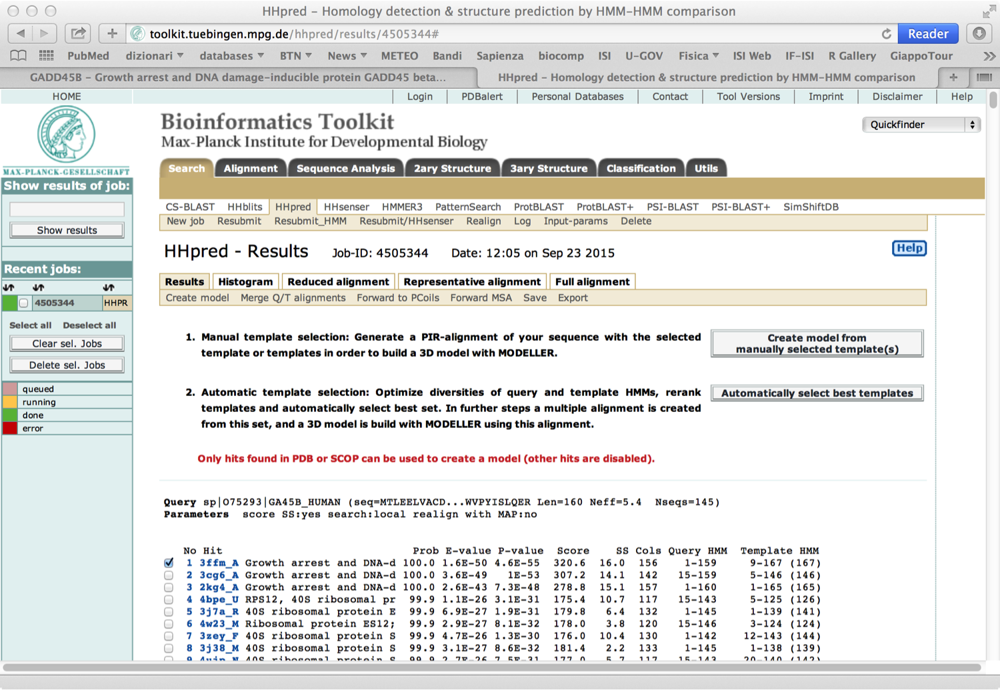

* Which is the best one? 
* Why? 

4) Go to the alignment between Gadd45β and its best template and take sometime to inspect it. 
* Is it reliable? 
* Do you think it might be manually improved? 
* Has it a good coverage?
* What is the sequence identity?
* What is the e-value? 
* Are the values of these two parameters good enough to proceed with the model building?

5) Once you are satisfied with the best template inspection, select it, then click on the "Create model" link immediately below the "Result, Histogram, etc." menu bar. In the resulting page, check whether the selected best template is the one that you actually selected, then click on the "Create model from manually selected template(s)" button.
You will end up in the "Modeller" page. The target-template alignment will appear in the Input text box ("Paste multiple alignment"). 

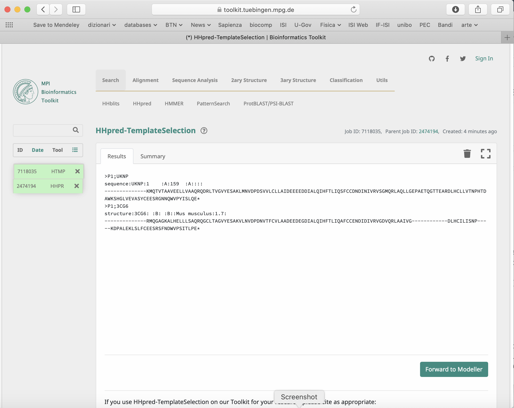

Notice that, if you want to run a local version of Modeller, you have to copy this alignment and paste it to a local text file with .ali extension. This is NOT what we are going to do here. Here, we will use the Modeller installation provided by The Bioinformatics Toolkit. Therefore, check the options and insert a MODELLER-key (you can use "MODELIRANJE") and a name for your Job in the Job-ID text box (I suggest "gadd45B_model" or something similar). 

Then, Submit your Job.

#### Congratulations! You have built a model for Gadd45β. You can Save it now. 

After downloading it, open the file with your favourite Text Editor (gedit, vim, pico, nano, etc) and take a few minutes to inspect the file.
Before going back to the prediction of the Gadd45β-MKK7 complex, we will spend a few minutes to check the quality of our model. 

# Model quality assessment with QMEAN

In protein structure prediction, a considerable number of alternative models are usually produced from which subsequently the final model has to be selected. Thus, a scoring function for the identification of the best model within an ensemble of alternative models is a key component of most protein structure prediction pipelines. QMEAN, which stands for Qualitative Model Energy ANalysis, is a composite scoring function **describing the major geometrical aspects of protein structures**. Five different structural descriptors are used. 
* The local geometry is analyzed by a new kind of torsion angle potential over three consecutive amino acids. 
* A secondary structure-specific distance-dependent pairwise residue-level potential is used to assess long-range interactions. 
* A solvation potential describes the burial status of the residues. 
* Two simple terms describing the agreement of predicted and calculated secondary structure and solvent accessibility, respectively, are also included. 
QMEAN was tested on several standard decoy sets including a molecular dynamics simulation decoy set as well as on a comprehensive data set of totally 22,420 models from server predictions for the 95 targets of CASP7. In a comparison to five well-established model quality assessment programs, QMEAN shows a statistically significant improvement over nearly all quality measures describing the ability of the scoring function to identify the native structure and to discriminate good from bad models. The three-residue torsion angle potential turned out to be very effective in recognizing the native fold (Benkert P, Tosatto SC, Schomburg D. Proteins. 2008 Apr;71(1):261-77).

Go to the help page of the [QMEAN Server for Model Quality Estimation](http://swissmodel.expasy.org/qmean/cgi/index.cgi) and carefully read it. Then go to the [Submit new](http://swissmodel.expasy.org/qmean) page, provide a name for your project (I suggest gadd45B_model_quality) and upload the gadd45B_model.pdb file and submit your job. Notice that the quality assessment may take some time. The QMEAN output is described below. Try to find out what is the quality of your model without reading this tutorial but using the help pages provided on the QMEAN website.

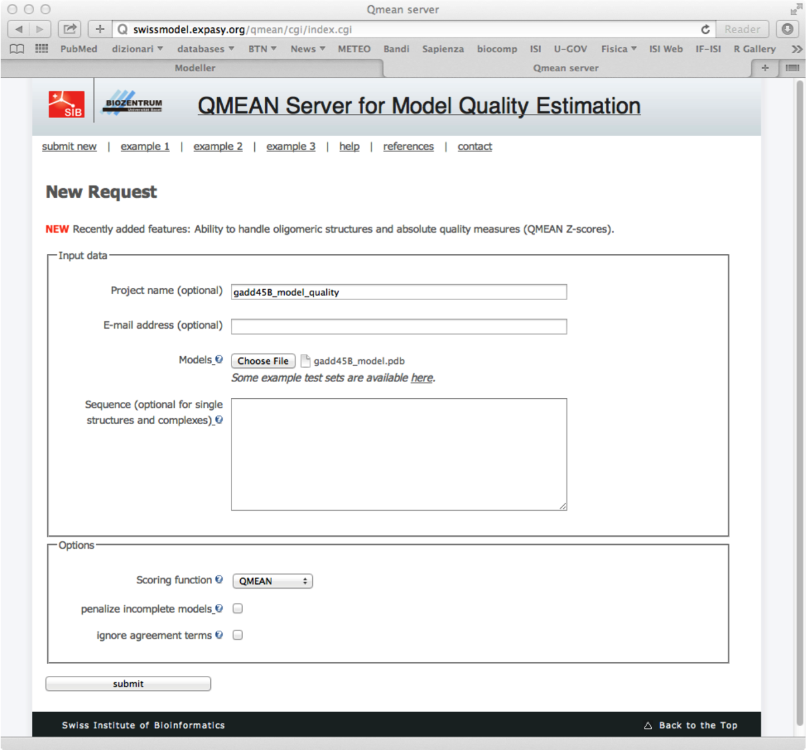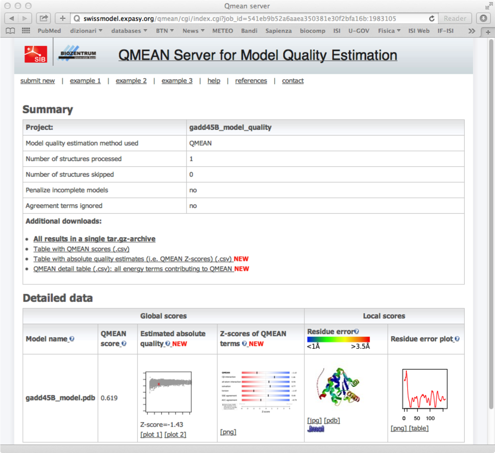

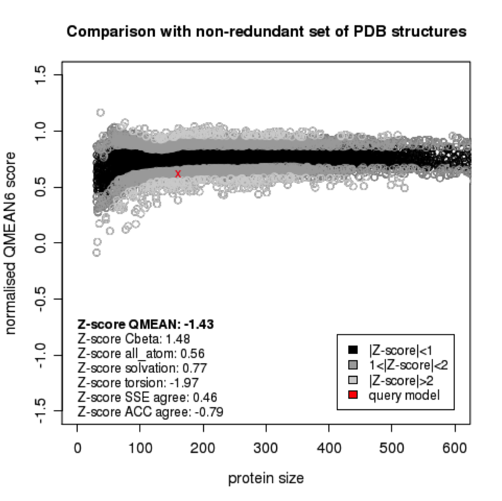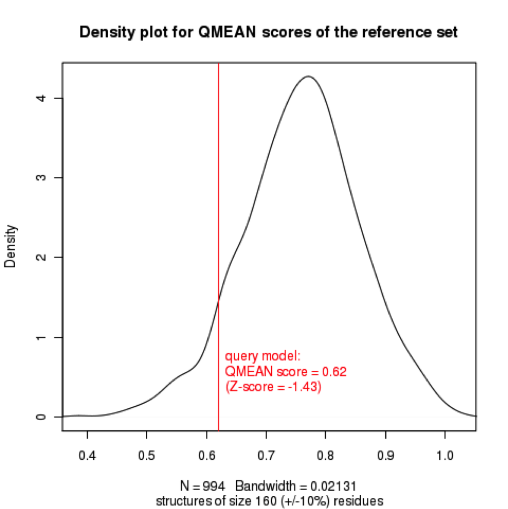

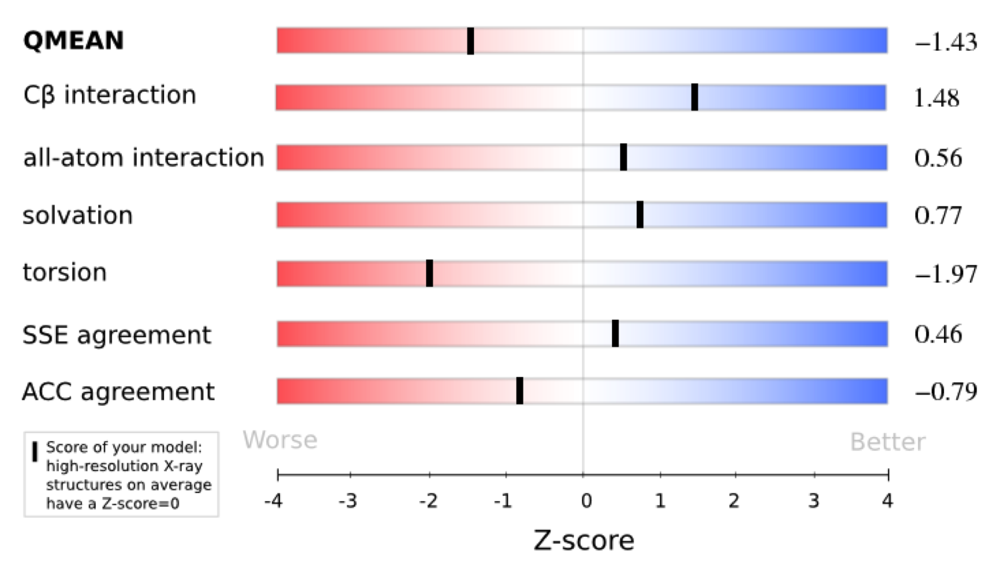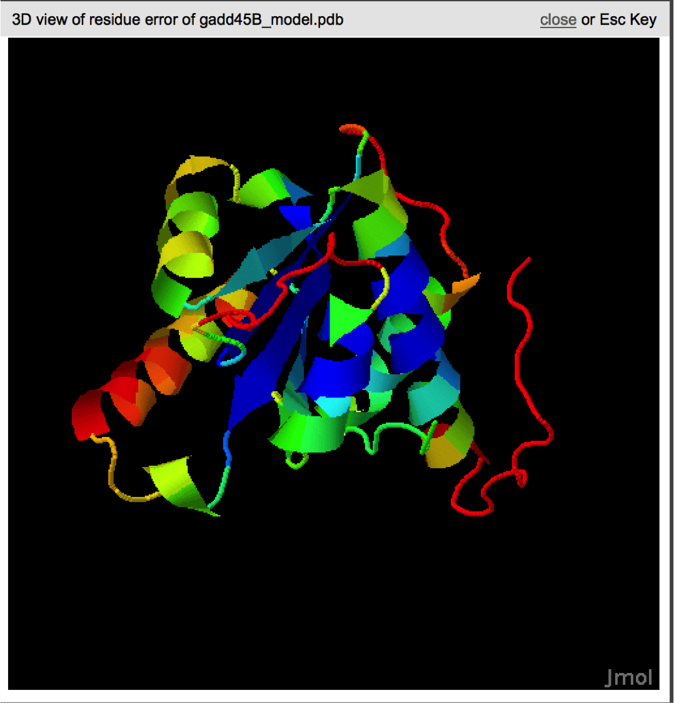

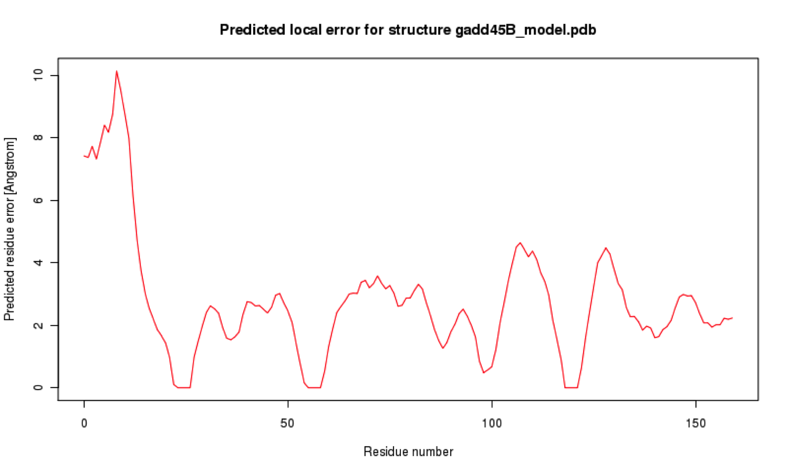

# References

##### Modeller
* Eswar, M. A. Marti-Renom, B. Webb, M. S. Madhusudhan, D. Eramian, M. Shen, U. Pieper, A. Sali (2006) Comparative Protein Structure Modeling With MODELLER. Current Protocols in Bioinformatics, John Wiley & Sons, Inc., Supplement 15, 5.6.1-5.6.30
* M.A. Marti-Renom, A. Stuart, A. Fiser, R. Sánchez, F. Melo, A. Sali. Comparative protein structure modeling of genes and genomes (2000) Annu. Rev. Biophys. Biomol. Struct. 29, 291-325
* Sali & T.L. Blundell (1993) Comparative protein modelling by satisfaction of spatial restraints. J. Mol. Biol. 234, 779-815
* Fiser, R.K. Do, & A. Sali (2000) Modeling of loops in protein structures, Protein Science 9. 1753-1773, 2000

##### Swiss-Model
* Arnold K., Bordoli L., Kopp J., and Schwede T. (2006). The SWISS-MODEL Workspace: A web-based environment for protein structure homology modelling. Bioinformatics, 22,195-201. 
* Kiefer F, Arnold K, Künzli M, Bordoli L, Schwede T (2009). The SWISS-MODEL Repository and associated resources. Nucleic Acids Research. 37, D387-D392. 
* Guex, N., Peitsch, M.C., Schwede, T. (2009). Automated comparative protein structure modeling with SWISS-MODEL and Swiss-PdbViewer: A historical perspective. Electrophoresis, 30(S1), S162-S173.

##### Other
* Chothia C, Lesk AM (1986): The relation between the divergence of sequence and structure in proteins. EMBO J. 5:823-836. 
* Rost B (1999): Twilight zone of protein sequence alignments. Protein Eng. 12:85-94. 
* Sander C, Schneider R (1991): Database of homology-derived protein structures and the structural meaning of sequence alignment. Proteins 9:56-68. 
* Venselaar H, Krieger E, Vriend G (2000) Homology Modeling

