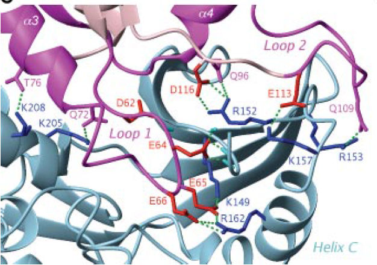

## Protein-protein interaction prediction using docking (ClusPro)

> ## Learning Objectives
>
> * Learners can describe the biological context of the MKK7-Gadd45B interaction
> * Learners can identify the restraints to limit docking conformations
> * Learners can predict the MKK7-Gadd45B complex using ClusPro
> * Learners can use restraints to filter docking solutions
> * Learners can critically explore ClusPro results


In this tutorial you are going to predict and analyse the structural complex between the human MKK7 and Gadd45B protein structures. Before we start using bioinformatics tools and resources, we have to learn something about these two proteins and their interaction. 

> Studying the literature and having a good grasp on the biological problem you are dealing with, is essential to take full advantage of predictions. Predictions are simply predictions until you don't analyse them in the light of the knowledge deriving from wet experiments.

## The biological background: MKK7 and Gadd45B

NF-kB/Rel factors control programmed cell death, and this control is crucial to oncogenesis, cancer chemoresistance, and antagonism of tumor necrosis factor (TNF) α-induced killing. With TNF, NF-kB-mediated protection involves suppression of the c-Jun-N-terminal kinase (JNK) cascade, and **Gadd45β**, a member of the Gadd45 family, was identified as a pivotal effector of this activity of NF-kB. Inhibition of TNFα-induced JNK signaling by Gadd45β depends on direct targeting of the JNK kinase, **MKK7/JNKK2**. The mechanism by which Gadd45β blunts MKK7, however, is unknown (Papa et al, JBC 2007, Tornatore et al, JMB 2008).

(Papa et al, JBC 2007) modelled the interaction between Gadd45β and MKK7 and validated the model through a number of complicated mutagenesis experiments.

The formation of the Gadd45β-MKK7 complex **enables insertion of the Gadd45β acidic loop 1 into the MKK7 catalytic pocket**, where this could engage in H-bonds and polar interactions with MKK7 Lys149 and other residues normally binding to the three-phosphate group of ATP. This engagement of the MKK7 ATP-binding site by Gadd45β loop 1 seems to prevent access of the kinase to ATP.
Therefore, **the Gadd45β-MKK7 complex formation inhibits MKK7 by preventing it from binding ATP**.
They also found that residues within putative Gadd45β acidic loops 1 and 2 – i.e. **Glu65, Glu66 and Glu113** – directly contact basic residues within the catalytic pocket of MKK7 – i.e **Lys149, Lys157 and Arg162**. In particular, as shown in the figure below (figure 9C from Papa et al. 2007) inter chain hydrogen bonds form between the following residues:

MKK7 residue | Gadd45β residue
:-------------:|:----------------:
K149         | E65
R162         | E66
K157         | E113



Figure 9C from Papa et al.2007


## Sharpening your pencils

Before starting the actual study of the interaction, we need to do a number of things to get ready.

1. Build the homology model of Gadd45β
2. Retrieve the crystal structure of the most suitable conformation for MKK7
3. Identify appropriate restraints to limit the number of docking conformations

Once we have collected these data, we will be ready to use [ClusPro](http://cluspro.bu.edu/home.php)to predict the MKK7-Gadd45β complex.

```
Note:
In the following you will need Gadd45β and MKK7 UniprotKB accession 
numbers (ACs). 
I suggest that you go to [UniprotKB](http://www.uniprot.org) and retrieve them. Remember that we are using the human proteins! 
If you know well UniprotKB or you are too lazy, here they are:

Gadd45β UniprotKB AC: O75293 
MKK7 UniprotKB AC: O14733 

```

### 1. Build the homology model of Gadd45β
At the time of writing, the crystal structure of Gadd45β is not available in the PDB. Therefore, we will use a homology model of Gadd45β. If you want to learn how to **build the homology model** of Gadd45β using HHPred (http://toolkit.tuebingen.mpg.de/hhpred), an online resource for homology modelling and more, you can follow the step-by-step [tutorial on homology modelling](tutorial_on_homology_modelling.md). For the purposes of this tutorial, you can download the model provided in the [pdb](https://github.com/aidanbudd/ppisnd/blob/4eb1724d5d9ce5dbd184288b0e2db304bf3c493d/trainingMaterial/allegraVia/PPI/data/pdb.tar.gz) folder and go to the next step.

### 2. Retrieve the crystal structure of the most appropriate conformation for MKK7

If you are already familiar with the Protein Data Bank (PDB) and/or want to quickly go to the next step, you can directly download the MKK7 3D structure (6QFL.pdb) from the [pdb](https://github.com/aidanbudd/ppisnd/blob/4eb1724d5d9ce5dbd184288b0e2db304bf3c493d/trainingMaterial/allegraVia/PPI/data/pdb.tar.gz) folder and skip the rest of this section. 6QFL was selected based on procedure and features described below.

If you want to learn how to use the PDB to retrieve structural information and search for specific PDB files, or want to know how 6QFL was selected, keep reading this section.

The crystal structure of MKK7 is available in the **Protein Data Bank (PDB)** and we want to identify the PDB code of the most suitable structure. What do we mean by "most suitable structure"? It depends on the problem at hand. 

In this specific case, we want one of the *crystal structures* corresponding to UniProt AC **O14733**. As we need the structure for a docking experiment, we would like a structure with the following features:
- high resolution (< 2.3 Angstroms)
- not in complex with ligand(s) (otherwise we have to manually remove ligands from the PDB file before using the structure in the docking experiment)
- ideally, in the conformation binding Gadd45β
- ideally, we would like to work with the native protein (i.e., not a mutant)

#### Procedure to select a high-resolution PDB structure for MKK7, not in complex with ligand(s): 

a) Go to the [PDB](http://www.rcsb.org/pdb/home/home.do)

b) Click on "Advanced search".
In the "Choose a Query Type" drop down menu choose "UniProtKB Accession Number(s)" and paste the MKK7 UniProt AC (**O14733**) in the text box.
Click on "Result Count". 

**Q:** How many structures are available for MKK7? 
Click on "Submit Query" and inspect the structures available. 

**Q:** Which one seems the most appropriate for our purposes?

Notice that there are 19 structures at the moment of updating these materials (March 2020). Examine the features of all the proteins available (are they whole proteins? are they mutants? What method was used to determine their structure? What resolution?) and check whether you can easily identify one ore more structures with the requisites listed above. 

c) Click on "Refine search".
Use the "Advanced search" interface to get rid of structures with resolution higher than 2.2 Angstrom AND of structures that have a ligand. To this aim, you have to add a search criterium for X-Ray resolution (set resolution between 0.1 and 2.2), a search criterium for "Has ligand(s)", and a search criterium for "Has modified residue(s)".

d) Click on "Submit Query".
**Q:** Which structures fullfil all search criteria you have used? If there are more than one, pick the one with better X-Ray resolution and/or the conformation that seems more appropriate for docking needs. 

e) Download the PDB file of the selected structure.


### 3. Identify appropriate restraints to limit the number of docking conformations
Structural models of complexes are more reliable if you can apply "restraints". Restraints can enormously reduce the configuration space size (making the program run faster) and direct the search towards more likely solutions. Restraints can be of many different types: a known or likely bond between two residues (one belonging to the receptor and the other one to the ligand), actraction/repulsion properties of one or more residues in one structure or both, etc. In many cases, we just know two proteins do interact but we have no idea about possible restraints. However, in some cases, restraints can be extracted from what we know about the interaction mechanism (from the literature or from experiments carried out in your lab). 

In this case, we know that *Gadd45β acidic loop 1 interacts with MKK7 Lys149, i.e. with the ATP binding site*. More specifically,(Papa et al, JBC 2007) found that residues within putative Gadd45β acidic loops 1 and 2 – i.e. Glu65, Glu66 and Glu113 – directly contact basic residues within the catalytic pocket of MKK7 – i.e Lys149, Lys157 and Arg162. Interacting pairs are reported in the following table:

MKK7 residue | Gadd45β residue
:---------------------:|:-----------------------:
K149 (ATP binding site)| E65
R162                   | E66
K157                   | E113

In order to use the bonds between the residues in the table as restraints in building the model of the complex, we need to identify them in the MKK7 and Gadd45β protein structure files, respectively. 
This is a rather technical issue, due to the fact that residue numbering might not be consistent between the literature and sequence and structure files. Furthermore, PDB residue numbering may differ from UniProt numbering. 
We will first check the consistency between the numbering used in the literature and in Uniprot protein sequences. Subsequently, we will verify the correspondence between residue numbers in UniProt sequences and in PDB protein structures. 

**Q:** What do you guess residue numbering inconsistencies are due to?

#### Identification of K149, R162, and K157 in the protein sequence of MKK7 (MKK UniProt AC: O14733)
a) Go to the "Function" section of the UniProt entry for MKK7. Check whether the ATP binding site residue has the same number as the one reported in the literature (K149);
b) Click on the residue Position(s) and identify the **sequence context** of K149 (e.g. the three residues before and after: IAVKQMR);
c) Starting from the position of K149 along the sequence, identify K157 and its sequence context (SGNKEEN) and R162 and its sequence context (ENKRILM);

#### Identification of K149, R162, and K157 in the protein structure of MKK7 (PDB CODE: 2DYL.pdb)
a) Go to the MKK7 PDB entry (http://www.rcsb.org/pdb/explore/explore.do?pdbId=2DYL) and click on the "Sequence" button in the menu bar. Identify the IAVKQMR sequence and the residue number corresponding to K149.
b) With a similar procedure identify the 2DYL residue numbers corresponding to K157 and R162;
This can also be done by inspecting the PDB text file that you can display by selecting the "PDB file" option from the "Display Files" drop-down menu.
You should also verify to which PDB chain this residues belong. Notice that 2DYL is a single chain structure .

#### Identification of E65, E66, and E113 in the protein sequence and structure of Gadd45β (Gadd45β Uniprot AC: O75293)
With a procedure similar to the one adopted for MKK7, go to Uniprot and identify the sequence context of Gadd45β E65, E66, and E113. This will help you find the corresponding residues in the protein structure (gadd45B_model.pdb). 

For your convenience, you can find below a table summarising this information.

|protein name|sequence residue num |sequence context |structure file   |structure residue num|
|------------|:---------------------:|:-----------------:|:-----------------:|:---------------------:|
|MKK7        |K149		   |IAVKQMR          |2DYL.pdb         |K165                 |
|            |R162                 |ENKRILM          |2DYL.pdb         |R178                 |
|            |K157                 |SGNKEEN          |2DYL.pdb         |K173                 |
|            |                     |                 |                 |                     | 
|Gadd45β     |E65                  |IDEEEEDD	     |gadd45B_model.pdb|E65                  |				
|            |E66		   |IDEEEEDD         |gadd45B_model.pdb|E66                  |
|            |E113                 |QGTTEARD         |gadd45B_model.pdb|E113


## ClusPro
* The first fully automated, web-based program for the computational docking of protein structures; 
* The docking algorithms evaluate billions of putative complexes, retaining a preset number with favorable surface complementarities; 
* A filtering method is then applied to this set of structures, selecting those with good electrostatic and desolvation free energies for further clustering; 
* The program output is a short list of putative complexes ranked according to their clustering properties;
* **User Input**: PDB files of the 2 protein structures 
* **Output**: 10 (default) top predictions of docked conformations close to the native structure;
* Rigid body docking is performed using  2 established FFT-based docking programs (DOT and ZDOCK);
* The scoring is solely based on the surface complementarity between the two structures;
* Over 2.7x10<sup>10</sup> structures are evaluated, retaining 20 000 structures with the best surface complementarity scores, which are then further subjected to an empirical free energy filtering algorithm;
* The top 2000 energetically favorable structures are clustered on the basis of a pairwise binding site root mean squared deviation (RMSD) criterion;
* **Clusters** are then formed by selecting the ligand that has the most neighbors below a previously selected clustering radius; 
* The ligand with the most neighbors is the cluster center, and is the representative structure for the cluster.


## Down to business: modelling the Gadd45β-MKK7 complex using ClusPro
Now we are ready to model the structure of the MKK7-Gadd45β complex. The data we are going to use are:
1. MKK7 PDB code: 2DYL
2. The file containing the homology model for Gadd45β: gadd45B_model.pdb
3. The restraints previously identified 

a) Go to the ClusPro webpage (http://cluspro.bu.edu/home.php). Here, you may want to create an account by clicking "Sign up for an account". You will receive an email with your account details that you can use to sign in.
b) If you don't want to create an account, click on "Use the server without the benefits of your own account". 
c) In the ClusPro input page that will appear, you have to 

* specify a Job Name (use a meaningful name, e.g. mkk-gadd45b)

 **Q:** Why should I use a meaningful name?

* Set "cpu" for the Server 
 
* insert the MKK7 PDB code (2DYL) in the Receptor text box (or upload the 2DYL.pdb file). 

 **Q:** Do we also need to specify the chain? Why?
 
* upload gadd45B_model.pdb for the Ligand. 

>**Important**: before uploading a model to the ClusPro server, you have to ensure that a chain id is present in the PDB file (column 22). You can do this by opening the PDB file with a text editor and checking whether a chain id is present. If it is not, you need to add a chain id to your PDB file. There are servers doing it.
>For example, you can go to:
>http://www.canoz.com/sdh/renamepdbchain.pl
>upload the PDB file (gadd45B_model.pdb), write a chain id (e.g., A) in the "Rename chain to:" textbox, specify whether you want the results displyed on screen
or written to an output file, and then click on 'Upload'. This is the file you will have to upload to ClusPro
>

 **Q:** Do we also need to specify the chain? Why? 
 
* Then, use the *Advanced Options* to set the restraints. 

By clicking on the Advanced Options, you will notice that several options appear. Spend a few minutes inspecting the available options and try to understand what they do. 

**Q:** In particular, what can you do with the "Restraints" options? 

**Q:** How could we use this option in our case?

#### Running ClusPro with the "Restraints" option

You can use the Restraints option to filter ClusPro solutions. In other words, if you have any knowledge about residues that should be close together in the interaction interface, you may want to run ClusPro using the "Restraints" option and use the knowledge you have to only produce results which satisfy your restraints. 
For example, the literature may provide information about interacting residues, as in our case.
Since we have quite specific information about mkk-gadd45b pairs of interacting residues, we can write it to a text file in *json* format and upload to ClusPro before running it.

**Q:** How can I write pairs of interacting residues to a *json* formatted file?

##### Writing restraints in a json file - Restraint Set Generator 
The restraint file needs to be in *json* format and you can generate it using the *restraint generator*. 

Each restraint specifies a pair of residues, one from the receptor and one form the ligand, and an acceptable distance range for the restraint to be satisfied. 

Restraints can be combined into restraint groups, and groups are combined into a restraint set, which allows users to specify some logic about how many restraints are required to be satisfied.

In the "Required percent of groups" you have to specify which percentage of groups are required to be satisfied. In this case, we only have three restraints and we can put all of them in a single group. If you want the group to be satisfied you will put 100%. Notice that the minimum number of groups required is 1.

In the "Required percentage of restraints" you have to specify which percentage of restraints are required to be satisfied. It is up to you to decide how much strict you want to be in filtering the solutions. If you put 100%, only solutions satisfying all the restraints will be retained. If you put 70%, 2/3 restraints must be satisfied. Etc.

In the Receptor Residue box, you have to write the chain and the first residue number of MKK reported in the table above (A 165). Chain and residue number need to be separated by a blank space. In the Ligand Residue box you have to write the chain and the number of the Gadd45b residue (A 65) interacting with MKK 'A 165'. In the Min Distance and Max Distance boxes you have to write an acceptable distance (in Angstroms) range for the restraint to be satisfied. Then click to 'Add restraint' and fill in the text boxes with the second and the third interacting pair's information. 

For the distance range you can try 1-5 for all the interacting pairs. 

A 165 --> A 65 --> 1-5

A 178 --> A 66 --> 1-5

A 173 --> A 113 --> 1-5

When you finish adding restraints, click on "Create Restraints". A piece of code will appear in the "Restraints" box below. You can copy it to a local text file with a .json suffix or use Save As...

```
{"required":1,"groups":[{"required":2,"restraints":[{"type":"residue","dmax":5,"dmin":1,"rec_chain":"A","rec_resid":"165","lig_chain":"A","lig_resid":"65"},{"type":"residue","dmax":5,"dmin":1,"rec_chain":"A","rec_resid":"178","lig_chain":"A","lig_resid":"66"},{"type":"residue","dmax":5,"dmin":1,"rec_chain":"A","rec_resid":"173","lig_chain":"A","lig_resid":"113"}]}]}
```
This is the file you have to upload to ClusPro
Restraints option. Then, you can run your job.

## Analysis of ClusPro results
The goal of ClusPro results' analyses is to identify, among the large number of docking conformations, those better fullfilling the restraints you have imposed. First, we have to navigate the ClusPro output page and identify sets of solutions ("models") we will download and further inspect. 
The inspection of the docking models will be carried out using the [UCSF Chimera](https://www.cgl.ucsf.edu/chimera/) program for the interactive visualization and analysis of molecular structures. The docking results' analysis using UCSF Chimera is described in the [tutorial on docking results analysis using UCSF Chimera] (tutorial_on_docking_results_using_chimera.md). If you are familiar with a different molecular graphics program (e.g. PyMol), don't hesitate to use it.
 
In the ClusPro output page you can:

### 1. Review the details of your Job 

**Q:** What input structures? 

**Q:** What options have you used?

### 2. View the Model Scores 
The most important aspect is to check whether there are docking solutions that form large clusters.
In our case, mkk7-gadd45b Cluster 0 has XXX members (balanced), XXX (Electrostatic-favored), XXX (Hydrophobic-favored); XXX (WdW+Elec)

In principle, we expect the best solution to be a conformation belonging to the largest cluster. 
However, there are other parameters that count. An important one is whether the predicted complex fulfils the input restraints, i.e. (in our case), whether the MKK7 ATP bindig site actually interacts with Gadd45β's residues in loop 1. In order to check this, you have to inspect the models displayed in the output page (each model is a representative of a cluster) and download those that seem to have a potentially correct conformation.
The first time you do it, you will have the impression the it may take hours to identify models having a potentially correct conformation. However, as soon as you become able to recognise the relative positions of the two proteins in the model, you will immediately detect (and discard) completely wrong docking poses.

As mentioned above, once you have downloaded a small number of potencially good conformations (these come in the form of PDB files), you can use a molecular graphics software to display each model, highlight MKK7 K165, R178, K173 and verify their position relatively to Gadd45β E65, E66, and E113. Basically you have to calculate the distance (in Angstrom) between pairs of supposedly interacting residues and check if it is below a reasonable interaction threshold.

**Q:** Which could be a reasonable interacton threshold? 

### 3. "Balanced", "Electrostatic-favored", "Hydrophobic favored", or "WdW+Elec"?
In the output page, you will see four different choices for your docking results, "Balanced", "Electrostatic-favored", and so on. 

**Q:** Which one should you choose?

CluPro provides many different options for docking because they believe good results go hand-in-hand with experimental knowledge of the complex. If you don't have any prior knowledge of what forces dominate in your complex, they recommend using the balanced coefficients. 
However, if for example you know from experiments that the receptor and the ligand have been observed to separate when subjected to ionic force in vitro, the interaction will likely be "Electrostatic-favored". Instead, if the two partners tend to separate when immersed in apolar solvents, they will likely be "Hydrophobic separated". If your complex is antibody-antigen, they recommend using the antibody mode.
In our case, we know that interactions between MKK7 and Gadd45β occur between basic (alkaline) MKK7 residues and acidic Gadd45 residues. Therefore, it might make sense to also have a look at "Electrostatic-favored" solutions. 


## References

##### Docking
* Halperin I, Ma B, Wolfson H, Nussinov R (2002) Principles of docking: an overview of search algorithms and a guide to scoring functions. PROTEINS: Structure, Function, and Generics 47: 409-443
* Katchalski-Katzir,E., Shariv,I., Eisenstein,M., Friesem,A., Aflalo,C. and Vakser,I.A. (1992) Molecular surface recognition—determination of geometric fit between proteins and their ligands by correlation techniques. Proc. Natl Acad. Sci. USA, 89, 2195–2199.
* Vakser,I.A. (1996) Low-resolution docking: prediction of complexes for underdetermined structures. Biopolymers, 39, 455–464.
* Ritchie,D.W. and Kemp,G.J.L. (2000) Protein docking using spherical polar Fourier correlations. Proteins, 39, 178–194.

##### Clustering
* Shortle,D., Simons,K.T. and Baker,D. (1998) Clustering of low-energy conformations near the native structures of small proteins. Proc. Natl Acad. Sci., USA, 95, 11158–11162
* Camacho,C.J. and Gatchell,D. (2003) Successful discrimination of protein interactions. Proteins, 52, 92–97

##### ClusPro
* Comeau, S. R., D. Gatchell, S. Vajda, and C. J. Camacho. 2004. ClusPro: an automated docking and discrimination method for the prediction of protein complexes. Bioinformatics. 20:45–50
* Kozakov D, Beglov D, Bohnuud T, Mottarella SE, Xia B, Hall DR, Vajda S. (2013) How good is automated protein docking? Proteins. 81(12):2159-66

#### Haddock 
* Dominguez C, Boelens R, Bonvin AMJJ (2003) HADDOCK:  A Protein−Protein Docking Approach Based on Biochemical or Biophysical Information. JACS 125, 1731
* de Vries SJ, van Dijk M, Bonvin AMJJ (2010) The HADDOCK web server for data-driven biomolecular docking. Nature Protocols, 5, 883-897 

##### Others
* Papa S, Monti SM, Vitale RM, Bubici C, Jayawardena S, Alvarez K, De Smaele E, Dathan N, Pedone C, Menotti Ruvo, Franzoso G (2007) Insights into the Structural Basis of the GADD45_-mediated Inactivation of the JNK Kinase, MKK7/JNKK2. JBC 282:19029-19041
* Tornatore L, Marasco D, Dathan N, Vitale RM, Benedetti E, Papa S, Franzoso G, Ruvo M, Monti SM (2008) J. Mol. Biol. 378: 97–111
* Perkins JR, Diboun I, Dessailly BH, Lees JG, Orengo C (2010) Transient Protein-Protein Interactions: Structural, Functional, and Network Properties. Structure 18:1233-1243
