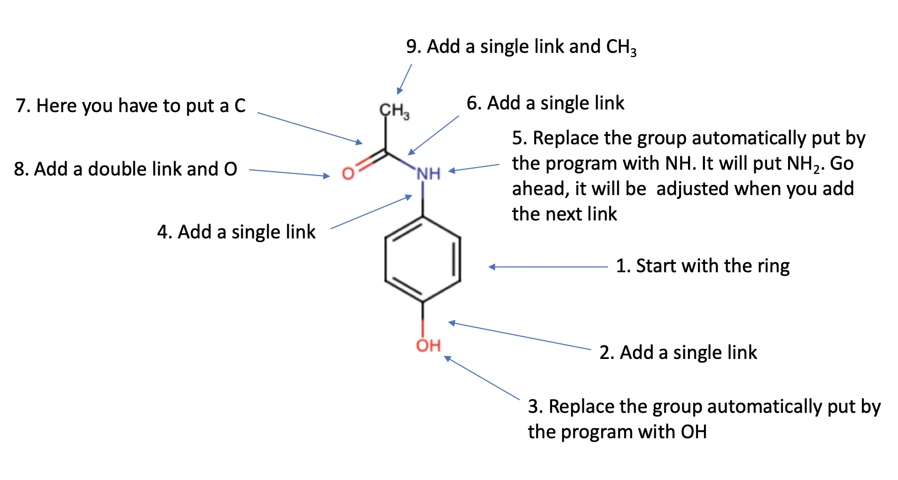

------------

> ## Learning Outcomes
> Learners will be able to:
> * use IntAct to find interaction partners of an input protein of interest
> * visualise the interaction network of an input protein 
> * download the results of their search 
> 
> ## The aim of this tutorial
> The aim of this tutorial is to give learners the chance to explore the DrugBank and ChEMBL databases and learn what kind of information they can find in these two databases.

------------
## Part I: [DrugBank](https://www.drugbank.ca)

#### Introduction: [About DrugBank](https://www.drugbank.ca/about)
The DrugBank database is a unique bioinformatics and cheminformatics resource that combines detailed drug data with comprehensive drug target information.

The DrugBank database is a comprehensive, freely accessible, online database containing information on drugs and drug targets. As both a bioinformatics and a cheminformatics resource, DrugBank combines detailed drug (i.e. chemical, pharmacological and pharmaceutical) data with comprehensive drug target (i.e. sequence, structure, and pathway) information. Because of its broad scope, comprehensive referencing and unusually detailed data descriptions, DrugBank is more akin to a drug encyclopedia than a drug database. As a result, links to DrugBank are maintained for nearly all drugs listed in Wikipedia. DrugBank is widely used by the drug industry, medicinal chemists, pharmacists, physicians, students and the general public. Its extensive drug and drug-target data has enabled the discovery and repurposing of a number of existing drugs to treat rare and newly identified illnesses.

The latest release of DrugBank (version 5.1.5, released 2020-01-03) contains 13,529 drug entries including 2,630 approved small molecule drugs, 1,372 approved biologics (proteins, peptides, vaccines, and allergenics), 131 nutraceuticals and over 6,354 experimental (discovery-phase) drugs. Additionally, 5,207 non-redundant protein (i.e. drug target/enzyme/transporter/carrier) sequences are linked to these drug entries. Each entry contains more than 200 data fields with half of the information being devoted to drug/chemical data and the other half devoted to drug target or protein data.

DrugBank is offered to the public as a freely available resource. Use and re-distribution of the data, in whole or in part, for commercial purposes (including internal use) requires a license. We ask that users who download significant portions of the database cite the DrugBank paper in any resulting publications.

#### Searching DrugBank
The goal of the first part of this tutorial is to make a comparison between **Aspirin** (**acetylsalicylic acid**) and **Paracetamol** (**Acetaminophen**) using information stored in DrugBank.

Go to [DrugBank](https://www.drugbank.ca). 

Using ```Browse > Drugs``` and/or ```Browse > Drug targets``` try to find out the similarities and differences between Aspirin and Paracetamol in terms of:

- Indication as per pain, fever, and inflammation
	a. Do the two molecules have the same indication as per pain, fever and inflammation? If no, what are the main differences?
- Pharmacodynamics
	a. Do the two molecules have the same pharmacodynamics features?
- Mechanism of action
	a. Do the two molecules have the same mechanism of action?
- Targets
	a. Do the two molecules have Targets in common? If yes, which one(s)?
- Experimental targets
	a. Do the two molecules have Enzymes in common? If yes, which one(s)?
- Toxicity in pregnancy and nursing
	a. Are the two molecules equally toxic/non toxic?
- Chemical structure
	a. How different are their chemical structures?
	b. How much their molecular weight do differ?
	c. Using the "search" option try to draw the chemical structure  of Acetaminophen (paracetamol) by playing with the tool provided at ```search > Chemical Structure```. See How I did it:
	
	
	
	d. Search DrugBank for identical structures (Exact)
	e. Search DrugBank for similar approved structures (try different similarity thresholds) and explore the results. Start with similarity threshold = 0.9. How many structure can you find? Then try 0.8. How many structures? At what similarity threshold can you find Aspirin?
	d. Go to ```search > Molecular Weight``` and search all DrugBank approved molecules with molecular weight within the range 151-152. How many approved drugs did you find? And how many approved drugs can you find in the weight range 180-181?
- Go to ```Help > Search DrugBank``` and see how to carry out advanced searches.
- Try to search ```acetaminophen AND "acetylsalicylic acid"```. How do you interpret the results of this search? Why, for example, you also find Oxycodone?
- Use ```Browse > Pathways``` and compare the Action Pathways of the two molecules.

## Part II: [ChEMBL](https://www.ebi.ac.uk/chembl/)

#### Introduction: [About ChEMBL](https://www.drugbank.ca/about)

ChEMBL is a database of bioactive drug-like small molecules, it contains 2-D structures, calculated properties (e.g. logP, Molecular Weight, Lipinski Parameters, etc.) and abstracted bioactivities (e.g. binding constants, pharmacology and ADMET data).

The data is abstracted and curated from the primary scientific literature, and cover a significant fraction of the SAR and discovery of modern drugs.

ChEMBL curators attempt to normalise the bioactivities into a uniform set of end-points and units where possible, and also to tag the links between a molecular target and a published assay with a set of varying confidence levels. Additional data on clinical progress of compounds is being integrated into ChEMBL at the current time.

You can browse ChEMBL documentation at the [New Web Interface](https://chembl.gitbook.io/chembl-interface-documentation/)

#### Searching ChEMBL

Go to [ChEMBL](https://www.ebi.ac.uk/chembl/).

Search ChEMBL using the **Acetaminophen** keyword. 

- You will get more than 10 results. What is the ChEMBL ID for paracetamol? 
- Explore the Acetaminophen (paracetamol) record. Does it contain the same information as the DrugBank corresponding record?
- What relevant information is present in ChEMBL (for paracetamol) that is missing in DrugBank? 
- What relevant information is present in the DrugBank (for paracetamol) that is missing in ChEMBL?
- In the ChEMBL homepage, click on ```Draw a structure```. You will notice that the tool to draw a structure is the same as the one provided by DrugBank. It should be pretty fast now to draw the Acetaminophen structure. Do it and then search ChEMBL using different values for the similarity threshold. By trying the same threshold values that you used in DrugBank, do you get the same results?
- What do you get if you do a ```Connectivity``` search? (I was not able to find it out...). What is the meaning of "Connectivity"? 

